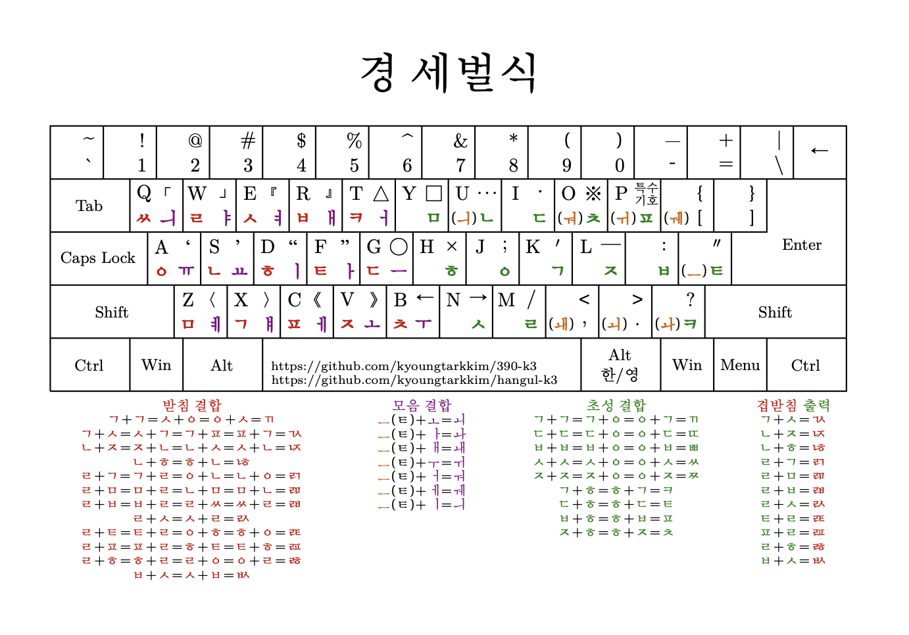

# Emacs용 경 세벌식 입력기

## Layout




## 경 세벌식 자판을 개발한 이유
군대를 제대하고 부터니까 2003년 경부터 390, 391자판을 사용하였는데, 벌써 즐겨 사용한지도 20년이 넘었습니다. 하지만, 공세벌식을 사용한 경험에 비해 신세벌식류는 사용한 경험이 많지는 않았습니다. 취미가 타자 연습인지라, 신세벌식을 사용해 보고자 마음먹고 다양한 신세벌식류를 많이
사용해 보면서 여러가지 신세벌식류 자판들의 장단점을 몸소 체험하고 깨닫게 되었습니다.
정통성을 가진 공세벌식 자판을 어떻게 갈마들이 신세벌식 자판으로 이식할지 고민하는 것은 많은 신세벌식 자판 개발자분들의 고민 거리일 것 입니다.
저도 저 나름대로 생각한 바가 있어, 이 문제에 대한 저만의 해답을 "경 세벌식" 자판이라는 이름으로 제시하고자 합니다; 자세한 부분은 아래의 특징 부분을 참고하시기 바랍니다.


## 왜 하필 이름을 경 세벌식이라고 지었나?
공경할 경(敬)자를 사용하여, 역사적인 공세벌식과 신세벌식을 존경한다는 의미로 지었습니다.

## 특징
1. 초성 입력 방법이 기존의 공세벌식 또는 여러 신세벌식류들과 완전히 다릅니다. 세모이 Layout에서 초성 입력 방법을 가져와서 거센소리를 추가하였습니다: 세모이 초성의 거센 소리 조합 방식도 여전히 사용할 수 있습니다.
   (개인적으로, 경 세벌식에서 사용하고 있는 세모이 초성의 확장 버젼이 초성 입력의 가장 좋은 방식이라고 여기고 있습니다)
3. 공세벌식류, 신세벌식류의 "ㅗ"와 "ㅜ"의 모음 결합 방식을 완전히 제거하고, "ㅚ","ㅘ","ㅙ","ㅟ","ㅝ","ㅞ"를 한번에 입력할 수 있도록 하였습니다. 처음에는 어색할 수 있으나 이 방법을 도입 후 오랜 시간 동안 타자 연습을 해오다 보니 이 방식이 더 우수하다는 확신올 가지고 있습니다.
4. 기존의 모음 결합 방식도 사용할 수 있도록 하였습니다: 하지만, "ㅗ"와 "ㅜ"를 사용하여 조합하지 않고, 편의상 모음 "ㅡ"만을 사용하도록 하였습니다:
   즉, "ㅡ + ㅗ = ㅚ", "ㅡ + ㅏ = ㅘ", "ㅡ + ㅐ = ㅙ", "ㅡ + ㅜ = ㅟ", "ㅡ + ㅓ = ㅝ", "ㅡ + ㅔ = ㅞ", "ㅡ + ㅣ = ㅢ"로 동작합니다.
6. 모음 출력시에는 기존의 "ㅗ"와 "ㅜ"를 사용하여 복모음을 만들 수 있는 방법도 그대로 유지하였습니다: 즉, 모음만을 출력하고자 할 때에는 "ㅗ + ㅣ = ㅚ"와 같은 조합이 작동합니다.
7. 가장 핵심적인 특징으로써, e키에 받침 "ㅅ"을 할당하였습니다: 이 점에 대해서 자세히 설명하자면... 공세벌식 계보를 잇고자 하는 신세벌식들은 대부분 e키에 받침 "ㅂ"을 할당합니다(공세벌식에서는 숫자 3키에 받침 "ㅂ"이 할당되어 있고, e키에는 모음 "ㅕ"가 할당되어 있습니다).
   제 타자 경험이 말해주는 바: e키의 자리는 신세벌식류에서 받침의 위치로써 좋은 자리이나 모음 "ㅣ(d키)"와 조합하여 사용할 시, d키는 왼손 중지로 e키는 왼손 약지로 주로 사용됩니다.
   하지만, d키(왼손 중지) + e키(왼손 약지)의 조합은 연습하면 전혀 어렵지 않은 손가락 조합이긴 하나, 고속 타자 시 방해 받는 느낌이 강하게 드는 손가락 조합이기도 합니다. 따라서, 저는 모음 "ㅣ(d키)"와의 최소한의 조합이 e키의 받침 자리에 어울린다고 생각했고 그 받침은 "ㅅ"이라고 생각합니다.
8. 받침 "ㅂ"은 경 세벌식에서 r키에 할당되어 있습니다. r키는 신세벌식에서 받침의 자리로 좋은 위치일 뿐만 아니라, e키의 받침 "ㅅ"과 조합하여 겹받침 "ᆹ"을 만들기도 좋습니다: 게다가 겹받침 "ᆹ"은 주로, 모음 "ㅏ(f키)"와 "ㅓ(t키)"와 조합되는데 이와도 찰떡 궁합입니다.
9. q키에는 겹받침 "ㅆ"을 할당하였습니다: 받침 "ㅆ"의 위치를 잘 결정하는 것은 아주 중요한 작업이며, 기존의 공세벌식의 숫자 2키에 할당되어진 "ㅆ"의 느낌과 역할과도 비슷하게 여겨집니다.
10. 초중종 타자 순서를 오른쪽에서 왼쪽으로 리듬감 있게 만들어 내는 공세벌식의 가장 큰 특징이자 장점인 (출현 빈도수가 높은) 받침 "ㅇ","ㅁ","ㄱ"의 위치를 그대로 고수하였습니다: 따라서, 받침 "ㅇ"은 a키, 받침 "ㅁ"은 z키, 받침 "ㄱ"은 x키의 위치를 여전히 가집니다.
11. 또한, e키 ,r키, t키에 해당되는 모음은 "ㅕ", "ㅐ", "ㅓ"로 정하였습니다. "ㅕ", "ㅐ", "ㅓ"순서의 ert키의 모음 배열은 사실 "ㅕ","ㅐ","ㅓ"만을 배치한다고 하였을 때, 최적의 순서 조합은 아니라고 생각되지만 이는 왼손 타자의 감성과 느낌에 중요한 영향을 준다고 생각합니다.
    그래서, 사실 이 부분이 공세벌식의 핵심 특징 중 하나라 생각하기에 순서를 이어 받았습니다.


## 사용 방법 (예를 통한 설명)
1. hangul-k3.el 파일을 다운로드 합니다.
2. ~/.emacs.d/hangul/hangul-k3.el 로 복사해 둡니다.
3. ~/.emacs 또는 ~/.emacs.d/init.el 파일 내에 아래와 같이 로딩 경로를 미리 설정해 놓고, 기본 입력기를 설정합니다:
   ```elisp
   (add-to-list 'load-path "~/.emacs.d/hangul")

   (require 'hangul-k3)
   (setq default-input-method "korean-hangul-k3")

5. Shift + Spacebar 또는 Control + Backslash 를 통해 Emacs 내부 입력기를 전환하여 경 세벌식을 사용합니다. 
